# ILIVE

Projeto desenvolvido para integrar uma API de Sistemas de Recomendação de Filmes, Músicas e Livros. Esse projeto
mobile tem como função trazer para usuários Android e iOS uma interface para compartilhar os resultados das recomendações
de forma prática.

## 💻 Videos de apresentação do ILIVE

Este primeiro vídeo tem como principal objetivo mostra de forma rápida a ideia geral do projeto.

- [Pitch ILIVE](https://www.youtube.com/watch?v=m8ei3NG0f-o)

Estou outro vídeo, mostra de forma clara o funcionamento de todos os recursos dentro do aplicativo.

- [Funcionamento do App ILIVE](https://youtu.be/wwrqDhepc04)

## 📍 Features do App(ILIVE) e suas características

- Login e Cadastro de usuários
- Exibição de uma lista de filmes, livros e músicas a serem recomendadas
- Inserção de fotos no perfil do usuário
- Recuperar senha do usuário.
- Interface Intuitiva

## Framework

- Flutter: É um kit de desenvolvimento de interface de usuário, de código aberto, criado pelo Google, que possibilita a criação de aplicativos compilados nativamente. Atualmente pode compilar para Android, iOS, Windows, Mac, Linux, Google Fuchsia e Web.
- Linguagem Dart: É uma linguagem de script voltada à web desenvolvida pela Google. Ela foi lançada na GOTO Conference 2011, que aconteceu de 10 a 11 de outubro de 2011 em Aarhus, na Dinamarca. O objetivo da linguagem Dart foi inicialmente a de substituir a JavaScript como a linguagem principal embutida nos navegadores.

[+Flutter](https://flutter.dev/)

### Logotipo ILIVE

### Fluxo Projeto ILIVE

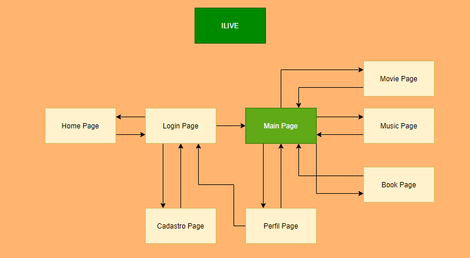

### Widgets Tree Pages
- HomePage

- LoginPage

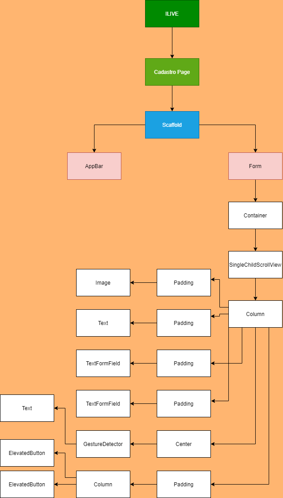

- RecuperarPage

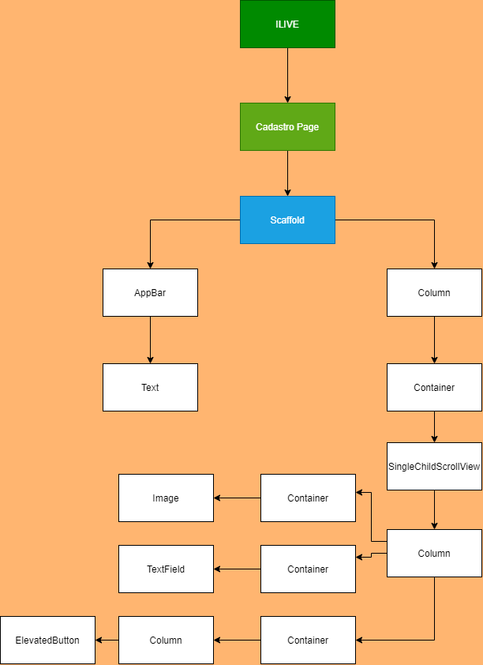

- MainPage

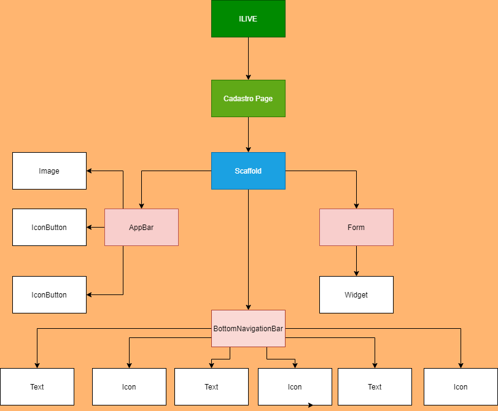

- PerfilPage

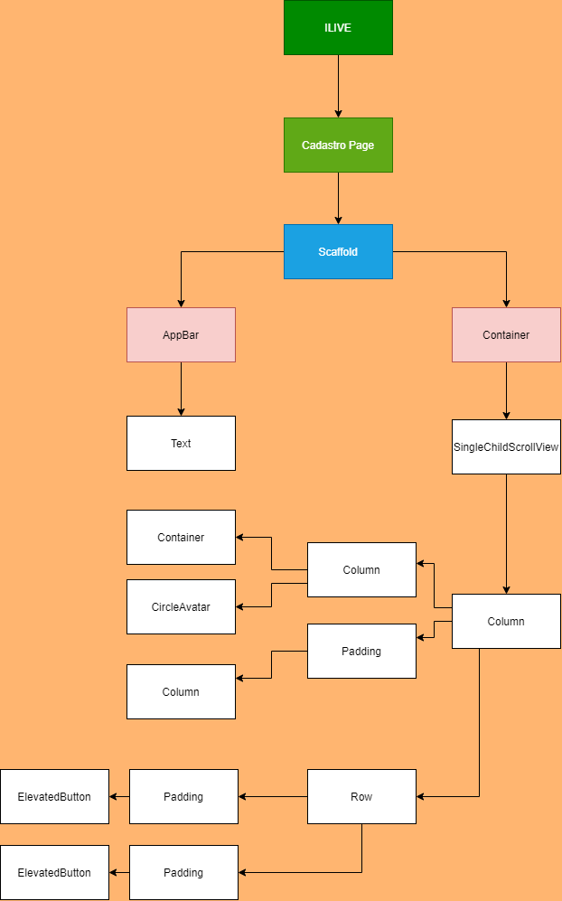

- MoviePage, MusicPage e BookPage

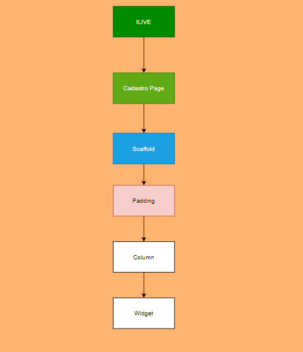

- CadastroPage

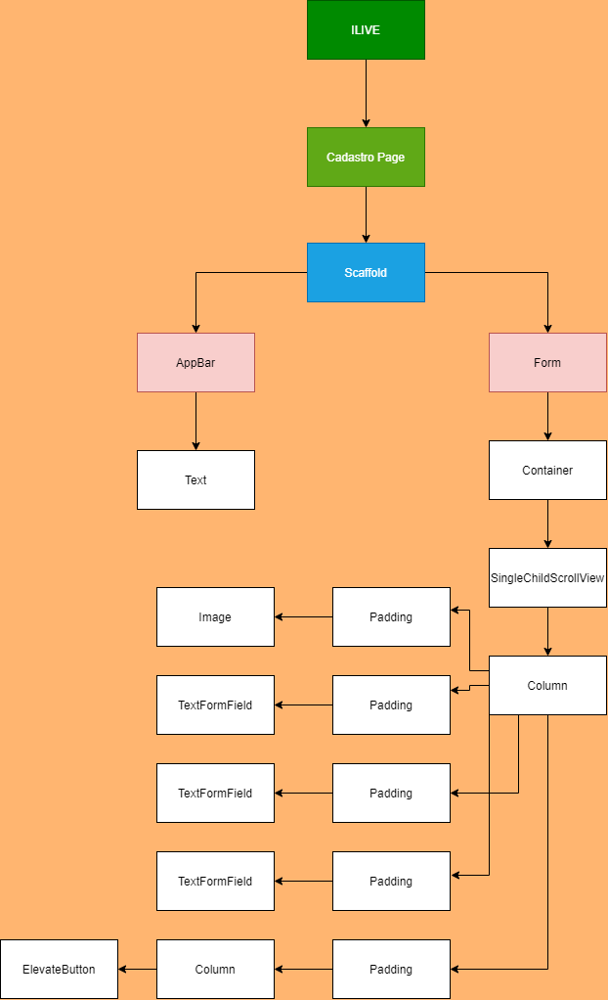

### Tela do App (Ilive)

- InicioTela

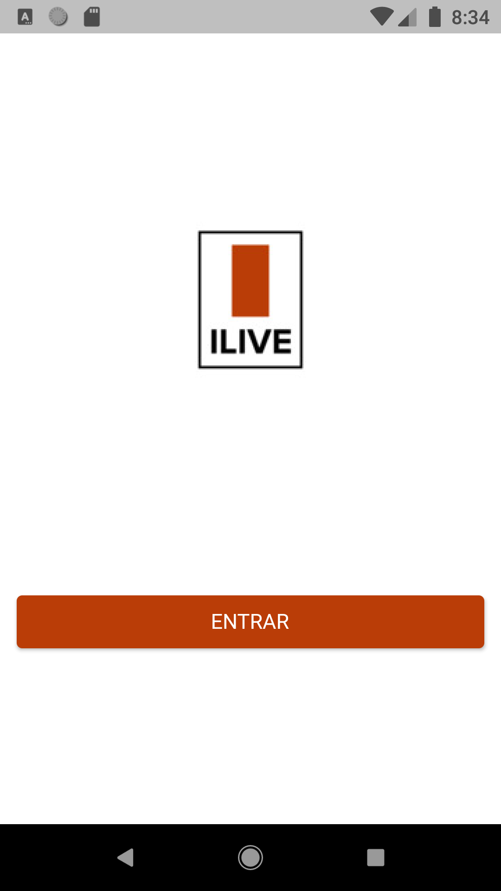

- LoginTela

- RecuperarTela

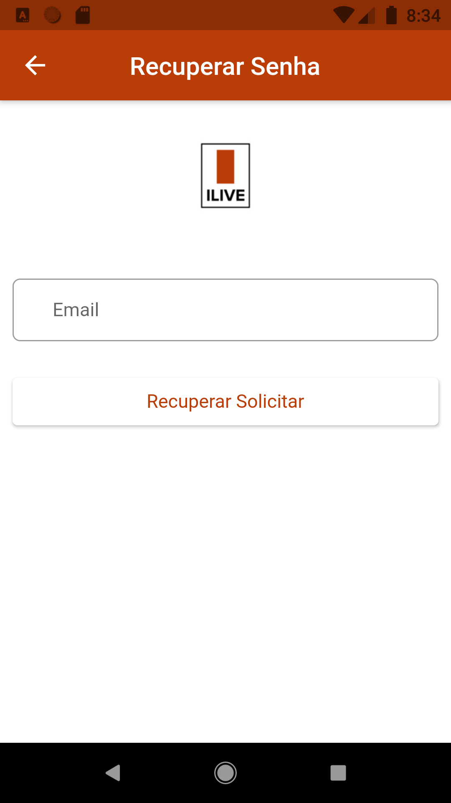

- PerfilTela

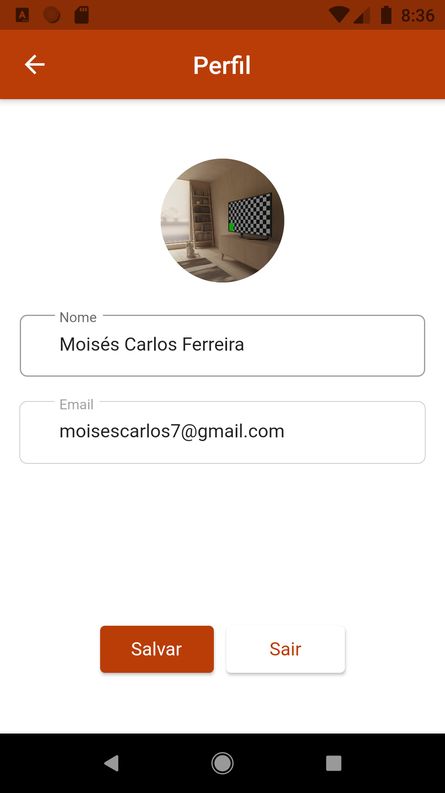

- CadastroTela

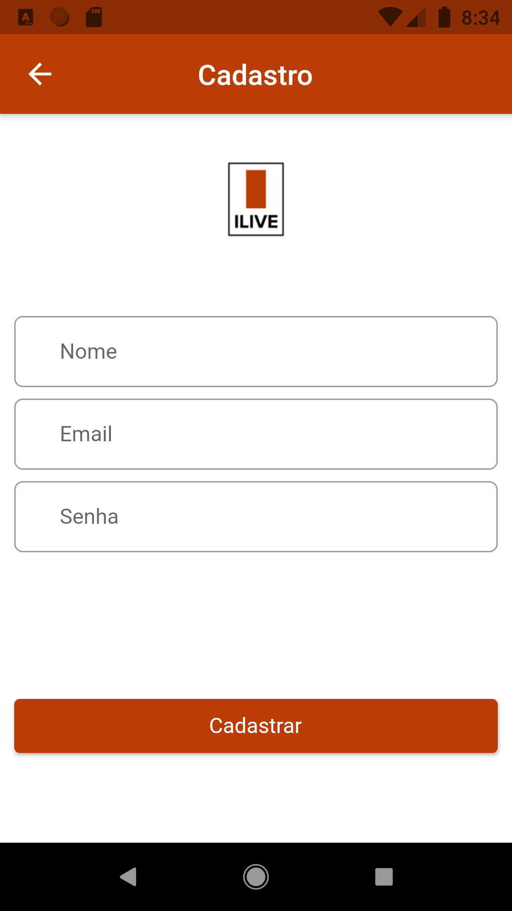

- FilmeTela

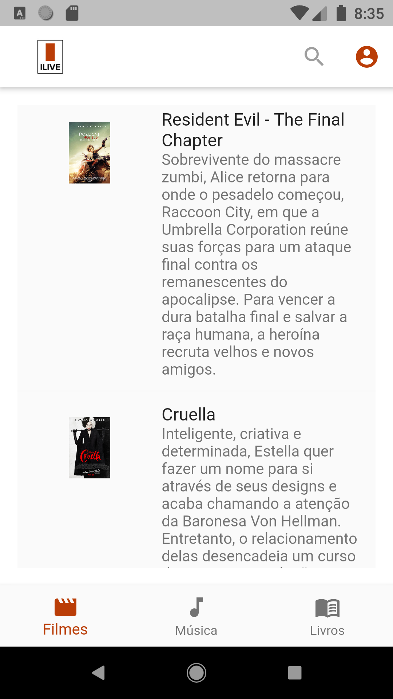

- MusicasTela

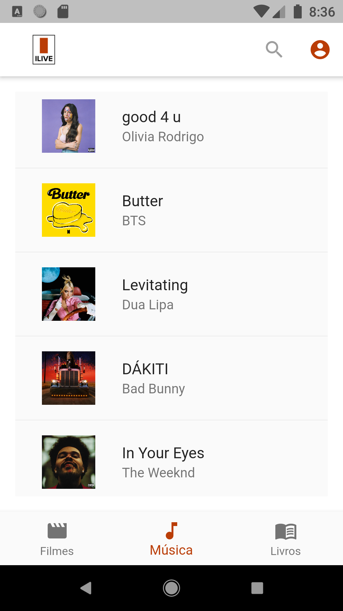

- LivrosTela

## Sobre o desenvolvedor

Moisés Carlos Ferreira: [LinkedIn](https://www.linkedin.com/in/mois%C3%A9s-carlos-44a288130/),
aluno de Mestrado em Informática Aplicada na UFRPE.

